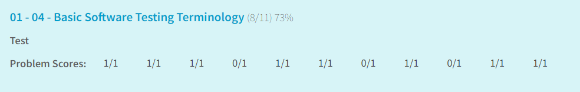
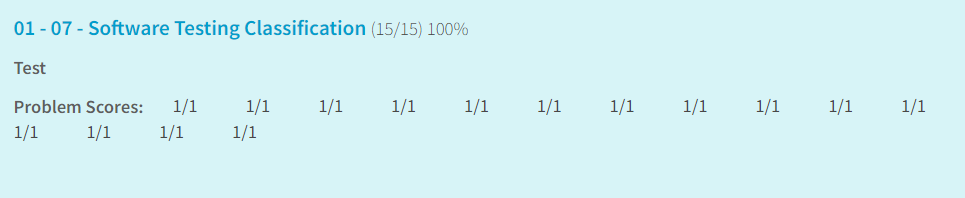

Практическая работа №1

Чепрасова Полина. КИ21-22Б
### Задача 1. Артефакты в тест-менеджменте
Изучить понятия: тест-кейсы, сеты тестов, чек-листы.
Научиться оформлять тест-кейсы (Куликов, раздел 2.4).
Изучите атрибуты тест-кейса, способы группирования.

Тест-кейс — набор входных данных, условий выполнения и ожидаемых результатов, разработанный с целью проверки того или иного свойства или поведения программного средства.
Сеты тестов — это группы тест-кейсов, которые объединены по какому-либо критерию, например, по функциональности или по этапу тестирования.
Чек-листы — это упрощенные списки задач или требований, которые необходимо проверить. Не так детализированы, как тест-кейсы; часто используются для быстрой проверки.

Пример:
```
ID теста: TC002

Название: Проверка регистрации нового пользователя.

Предусловия: Пользователь зарегистрирован на сайте.

Шаги:
1. Открыть страницу регистрации.
2. Ввести корректный логин.
3. Ввести корректный адрес электронной почты.
4. Ввести корректный пароль.
5. Подтвердить пароль.
6. Нажать кнопку "Зарегистрироваться".

Ожидаемый результат: Пользователь успешно зарегистрирован и перенаправлен на страницу приветствия.
```

### Задача 2. Тесты на знание теор. материала
2.1. 01-04 Basic Software Testing Terminology Test

2.2. 01-07 Software Testing Classification Test

### Задача 3. Метрики полноты покрытия кода
(см. из литературы — Майерс, «Искусство тестирования ПО»)

1. Покрытие операторов — измеряет процент операторов (строк кода), выполненных в ходе тестирования. 
2. Покрытие решений — измеряет процент условий (ветвлений), которые были выполнены. 
3. Покрытие условий — измеряет, были ли проверены все условия в логических выражениях. 
Пример:
```c#
if (A && B)
    {
        ...
    }
    else
    {
        ...
    }
```

- Покрытие операторов: 100% (оба действия проверяются)
- Покрытие решений: 100% (оба пути if проверяются)
- Покрытие условий: 100% (оба условия A и B проверяются)
### Задача 4. Изучение платформы для юнит-тестирования

```c#
[TestClass]
public class CalculatorTests
{
    private Calculator _calculator;

    [TestInitialize]
    public void TestInitialize()
    {
        _calculator = new Calculator();
    }

    [TestCleanup]
    public void TestCleanUp()
    {
        _calculator = null;
    }

    [TestMethod]
    [DataRow(1, 2, 3)]
    [DataRow(-1, -1, -2)]
    public void Add_TwoNumbers_ReturnsSum(int a, int b, int expected)
    {
        var result = _calculator.Add(a, b);
        Assert.AreEqual(expected, result);
    }
}
```

Атрибуты:
- TestClass: Определяет класс как класс тестирования.
- TestMethod: Определяет метод как метод тестирования.
- DataRow: Позволяет передавать параметры в тестовый метод.
- DataTestMethod: Используется вместе с DataRow для параметризованных тестов.
- TestInitialize: Метод, который выполняется перед каждым тестом.
- TestCleanUp: Метод, который выполняется после каждого теста.

Методы класса Assert:
- Assert.AreEqual(). Проверяет два аргумента на равенство.
- Assert.AreSame(). Проверяет, ссылаются ли переменные на одну и ту же область памяти. 
- Assert.InstanceOfType(). Метод для проверки типа объекта. 
- Assert.IsTrue, Asser.IsFalse. Проверка логических конструкций. 
- Equal(expected, result). Сравнение результатов теста в виде значения result и ожидаемого значения expected и подтверждение их равенства. 
- NotEqual(expected, result). Сравнение результатов теста в виде значения result и ожидаемого значения expected и подтверждение их неравенства. 
